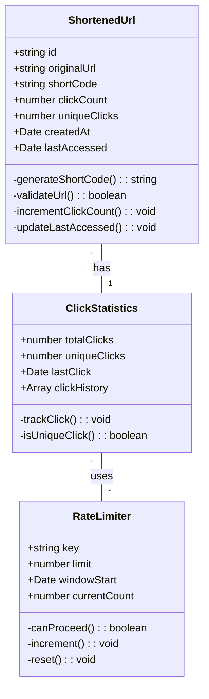

  

<h1 align="center">
  Eficientis Backend Challenge
</h1>

This technical assessment requires the development of a robust URL shortening service using modern Node.js technologies. The service should provide RESTful endpoints for URL shortening and redirection while maintaining high performance and reliability.

## Technical Requirements

The solution must be implemented using:

- **Language & Framework**:

  - TypeScript (latest stable version)
  - Express.js (latest stable version)

- **Development Tools**:

  - ESLint for code linting
  - Prettier for code formatting
  - Jest for unit and integration testing
  - npm as package manager

- **Code Quality**:

  - TypeScript strict mode enabled
  - Comprehensive type definitions
  - Code coverage reports
  - Automated formatting on commit

- **Data Persistence** (choose one):

  - In-memory storage
  - JSON file storage
  - SQLite database

- **Optional Enhancements**:
  - Docker containerization
  - PostgreSQL database with Docker Compose
  - Redis caching layer

## API Endpoints

The URL shortening service should implement the following RESTful endpoints:

### 1. URL Shortening

- **POST /api/v1/urls**
  - Create a new shortened URL
  - Request body: `{ "originalUrl": "https://example.com" }`
  - Response: `{ "shortUrl": "https://your-domain.com/s/abc123" }`

### 2. URL Redirection

- **GET /:shortCode**
  - Redirect to original URL
  - Track redirection statistics

### 3. Statistics

- **GET /api/v1/urls/:shortCode/stats**
  - Get statistics for a specific shortened URL
  - Response includes: total clicks, unique clicks, timestamp of last click

## Core Implementation Requirements

1. **Core Functionality**

   - Implement URL shortening algorithm
   - Handle URL validation
   - Implement redirection with proper HTTP status codes
   - Track URL statistics

2. **Security**

   - Implement rate limiting
   - Validate URLs before shortening
   - Implement proper CORS configuration
   - Handle errors gracefully

3. **Testing**
   - Unit tests for all business logic
   - Integration tests for API endpoints
   - Test coverage > 80%
   - Performance benchmarks

## Data Model

## Optional Enhancements

1. **Advanced Features**

   - Custom short codes
   - URL expiration
   - Batch URL processing
   - Redis caching implementation

2. **Monitoring & Logging**
   - Implement request/response logging
   - Add performance monitoring
   - Set up error tracking

## Submission Guidelines

1. Fork this repository to your GitHub account
2. Complete the implementation
3. Ensure all tests pass
4. Document your solution in `SOLUTION.md`
5. Submit the pull request with your changes

## Evaluation Criteria

Your solution will be evaluated based on:

1. Code Quality

   - Clean and maintainable code
   - Proper TypeScript usage
   - Comprehensive error handling
   - Code documentation

2. Architecture

   - Proper separation of concerns
   - Scalable design
   - Security considerations

3. Testing

   - Test coverage
   - Test quality
   - Performance benchmarks

4. Documentation
   - Code documentation
   - API documentation
   - Setup instructions
