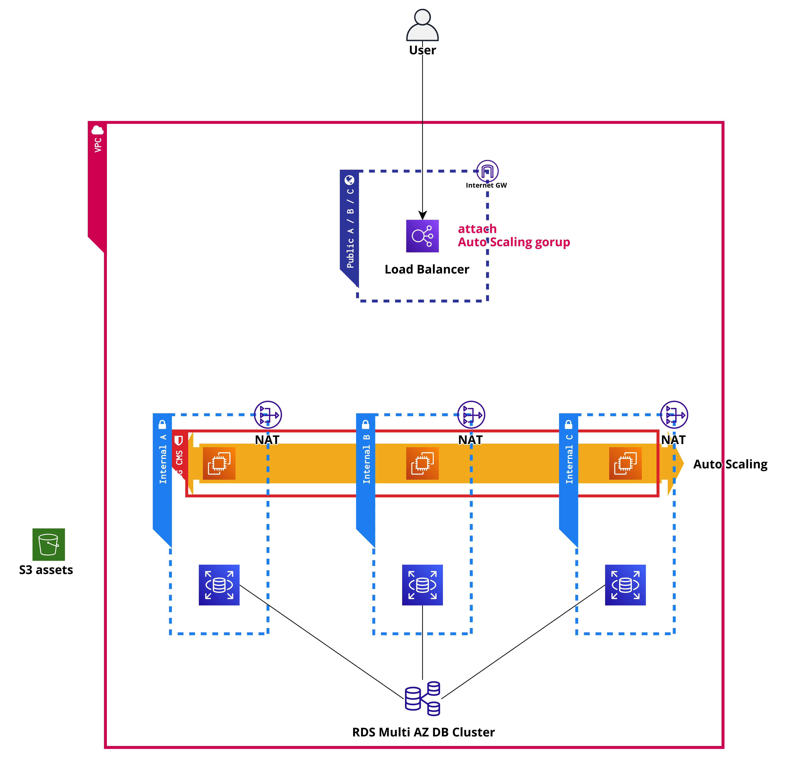

<p align="center">
  <a href="https://eficientis.app">
    
  </a>
</p>

<h1 align="center">
  Eficientis DevOps Technical Assessment
</h1>

This technical assessment has been meticulously crafted to evaluate your DevOps expertise through a series of practical challenges that mirror real-world scenarios encountered in our organization. To participate, please fork this repository to your GitHub account and complete the challenges at your own pace.

Upon completion, please ensure that all necessary files are uploaded to facilitate the reproduction of your solutions. Additionally, we encourage you to create a `SOLUTION.md` file in each challenge directory to provide detailed explanations of your approach and implementation.

Each challenge consists of both mandatory and optional tasks. While the mandatory tasks are essential for assessment, we strongly encourage you to tackle the optional tasks to showcase your advanced knowledge and problem-solving capabilities. Should you require any clarification regarding the challenges, please feel free to open an issue in the repository.

## Prerequisites

To successfully complete this assessment, you will need the following tools and accounts:

- GitHub account (https://github.com/signup)
- Infrastructure as Code (IaC) Test Environment:
  - AWS Free Tier account (https://aws.amazon.com/free/)
  - OR Localstack API (https://localstack.cloud)
- Docker Hub account (https://hub.docker.com)
- Required Software:
  - Docker (https://www.docker.com)
  - Terraform (https://www.terraform.io)
  - Kubernetes (select one):
    - KinD (https://kind.sigs.k8s.io)
    - Minikube (https://minikube.sigs.k8s.io/docs/start/)
    - k3s (https://k3s.io)

## Initial Setup

To begin the assessment, please clone the repository using the following command:

```bash
git clone https://github.com/eficientis/eficientis.recruitment.git
```

## Challenge 1: Docker and CI/CD Implementation

### Objective

Develop a web server application using your preferred programming language (Node.js recommended) that listens on port 8000 and returns structured information about the container environment when accessed.

### Requirements

- Create a web server application that listens on port 8000
- The server should return a structured response containing container information
- Create a Dockerfile to containerize the application
- Build and test the Docker image

### Resources

- HTTP Server documentation: https://docs.python.org/3/library/http.server.html
- Dockerfile instructions: https://docs.docker.com/develop/develop-images/instructions/

### Optional Enhancements

- Implement command-line arguments (e.g., `--host`, `--port`)
- Enhance Dockerfile security measures
- Support runtime arguments via `docker run`
- Achieve optimal Docker image coverage using `dive` (configuration provided in `.dive-ci`)

```bash
# command
CI=true dive <your-image-tag>

# result
Result:PASS [Total:3] [Passed:3] [Failed:0] [Warn:0] [Skipped:0]
```

- Upload your image to Docker Hub account with Github Actions ([docker/build-push-action](https://github.com/docker/build-push-action))

## Challenge 2: Kubernetes Deployment and Helm Chart Development

### Objective

Deploy the application developed in Challenge 1 to a Kubernetes cluster using Helm charts, with the application exposed via an Ingress controller.

### Requirements

- Create a Helm chart for the application
- Deploy the application to your Kubernetes cluster
- Configure an Ingress controller (Nginx or Traefik)
- Ensure proper application exposure and accessibility

### Alternative Approach

If Challenge 1 was not completed, use the latest `httpd` image in the Helm chart.

### Resources

- Helm best practices: https://helm.sh/docs/chart_best_practices
- NIP.io documentation: https://nip.io
- Kubernetes documentation:
  - KinD: https://kind.sigs.k8s.io
  - Minikube: https://minikube.sigs.k8s.io/docs/start/
  - k3s: https://k3s.io
- Ingress Controller documentation: https://kubernetes.io/docs/concepts/services-networking/ingress-controllers/

### Optional Enhancements

- Generate comprehensive Helm chart documentation
- Implement end-to-end testing using GitHub Actions
- Validate `values.yaml` using `values.schema.json`

## Challenge 3: Infrastructure as Code Implementation with Terraform

### Objective

Develop Terraform manifests to implement the infrastructure shown in the diagram below, ensuring proper configuration and service initialization.

### Requirements

- Create Terraform manifests for the specified infrastructure
- Implement `user_data` to install and configure `httpd` service
- Ensure proper infrastructure organization and documentation
- Create `challenge-3` directory to store all files

### Infrastructure Diagram



### Expected Output

Upon successful deployment, the Load Balancer should return the following response:


### Resources

- IaC Test Environment:
  - AWS Free Tier account: https://aws.amazon.com/free/
  - Localstack API: https://localstack.cloud
- Terraform Documentation:
  - Best practices: https://cloud.google.com/docs/terraform/best-practices-for-terraform
  - AWS Provider: https://registry.terraform.io/providers/hashicorp/aws/latest
  - AWS Modules:
    - Load Balancer: https://registry.terraform.io/modules/terraform-aws-modules/alb/aws/latest
    - S3: https://registry.terraform.io/modules/terraform-aws-modules/s3-bucket/aws/latest
    - RDS Cluster: https://registry.terraform.io/modules/terraform-aws-modules/rds-aurora/aws/latest
    - VPC: https://registry.terraform.io/modules/terraform-aws-modules/vpc/aws/latest
    - Auto Scaling Groups: https://registry.terraform.io/modules/terraform-aws-modules/autoscaling/aws/latest

### Optional Enhancements

- Generate comprehensive Terraform documentation using `terraform-docs`
- Implement Terraform syntax validation and linting:
  - Syntax validation
  - Code formatting (`fmt`)
  - Security scanning (`tflint`)
  - Security assessment (`tfsec` - save results without fixing)
- Create GitHub Actions workflows for Terraform validation and linting
